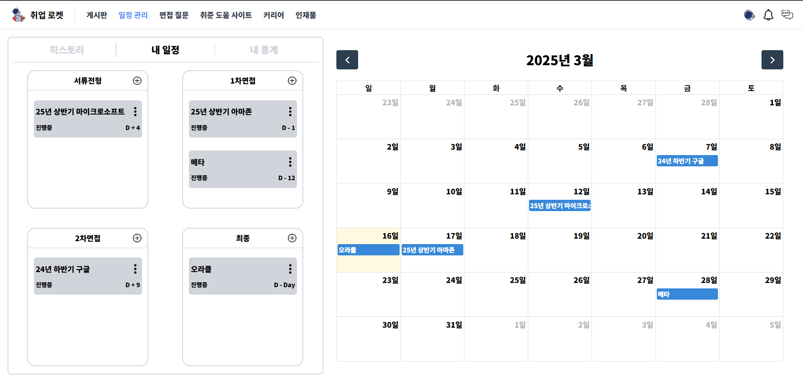

# 🚀취업 로켓

  
   
  전체 프로젝트 기간 : 2024-11-15 ~ ing  
  

  <a href="#">팀 노션</a>
  &nbsp; | &nbsp; 
  <a href="#">API 명세서</a>
  &nbsp; | &nbsp;
  <a href="https://shins99.notion.site/13a7b22f725181a8b443cb71a0869d08?pvs=4">요구사항 정의서</a>   &nbsp; | &nbsp;
  <a href="https://www.figma.com/design/TzQQwcO49HL32VKGTRQVKI/%EC%B7%A8%EC%97%85%EB%A1%9C%EC%BC%93%3A%ED%99%94%EB%A9%B4%EC%84%A4%EA%B3%84%EC%84%9C?node-id=0-1&node-type=canvas">figma</a> 
   
  <a href="#">그라운드 룰</a>
  &nbsp; | &nbsp; 
  <a href="#">트러블 슈팅</a>

## 📢 취업 로켓 사용해보기

## ⚙️ 기술스택

 

    

    <h3 style="border-bottom: 1px  color: #282d33;"> FrontEnd </h3>
        
 
          
          
          
          
          
          
          
        

        

        <h3 style="border-bottom: 1px solid #d8dee4; color: #282d33;"> BackEnd </h3>
          

              
              
              
              
              
              
              
        

<h3 style="border-bottom: 1px solid #d8dee4; color: #282d33;"> Infra </h3>
    

          
          
          
          
          
    

  <h3 style="border-bottom: 1px  color: #282d33;"> 협업 </h3>
    

      
      
      
    

## 🏛️ 시스템 아키텍처

## 🗂️ Directory 구조도

### BE

### FE

## 🚀 핵심 기능

### 회원

#### 로그인

#### 내정보

#### 쪽지

### 일정관리

#### 일정 목록

#### 일정 생성

#### 일정 수정

#### 일정 삭제

#### 통계

#### 히스토리

### 게시판

#### 자유 게시판

#### 질문 게시판

#### 후기 게시판

### 면접 질문

#### cs 기반 면접질문

#### 자소서 및 이력서 기반 면접 질문

## 팀원 소개

|                신동구                |                     안채원                     |                   정기석                   |                 장호영                 |
| :----------------------------------: | :--------------------------------------------: | :----------------------------------------: | :------------------------------------: |
|           |                     |                   |               |
|            **Full-Stack**            |                 **Full-Stack**                 |               **Full-Stack**               |             **Full-Stack**             |
| [@shsh99](https://github.com/shsh99) | [@woneveryday](https://github.com/woneveryday) | [@wjdrltjr5](https://github.com/wjdrltjr5) | [@jang643](https://github.com/jang643) |
